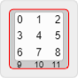

# Specification

### Keyboard Objects

```ts
Keyboard {
  meta: KeyboardMetadata;
  keys: Key[];
}
```

A `Keyboard` is an object containg keyboard metadata (`meta`) and an array of
`keys`.

### Keyboard Metadata

The `meta` object contains several fields:

```ts
KeyboardMetadata {
  switchType: string;
}
```

- `switchType` — the _default_ type of switches on your keyboard.
    - Default can be overridden on individual keys.
    - Options are `cherry`, `alps`, and `choc`

### Keys

Each key in the `keys` array contains the following data:

```ts
Key {
  labels: string[];

  x: number;
  y: number;
  width: number;
  height: number;

  rotation_x: number;
  rotation_y: number;
  rotation_angle: number;

  profile: string;

  switchType: string;
}
```

- `labels` — an array of up to 12 text labels (sometimes referred to as
  'legends'):
    - In reading order, i.e., left-to-right, top-to-bottom:
        - 
    - The labels are user input, and may contain arbitrary HTML content; when
    rendering, input sanitization is recommended for security purposes.
- `x` / `y` — the absolute position of the key in keyboard units (where _1u_ is
  the size of a standard 1x1 keycap).
- `width` / `height` — the size of the key, in keyboard units.
- `rotation_x` / `rotation_y` — defines the center of rotation for the key.
- `rotation_angle` — specifies the angle the key is rotated (about the center of
  rotation).
- `profile` — specifies the key's "profile" (and row, for those profiles that
  vary depending on the row), e.g., "`DCS R1`" or "`DSA`".
    - Currently supported / known profiles: `SA`, `DSA`, `DCS`, `OEM`, `CHICKLET`,
    `FLAT`
    - Currently supported / known rows: `R1`, `R2`, `R3`, `R4`, `R5`, `SPACE`
- `switchType` — the switch type, overriding the
  default values specified in the keyboard metadata.